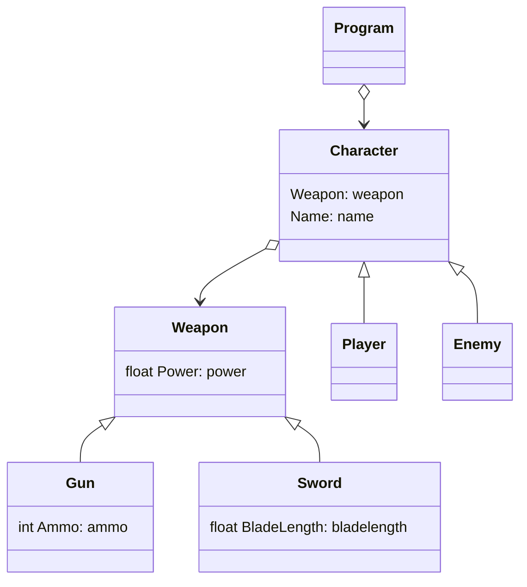

# UML

```mermaid 

classDiagram
    class Character{
        Weapon: weapon
        Name: name
    }
    class Weapon{
        float Power: power
    }
    class Sword{
        float BladeLength: bladelength
    }
    class Gun{
        int Ammo: ammo
    }
    class Player{

    }
    class Enemy{
        
    }

    Character <|-- Player
    Character <|-- Enemy
    Weapon  <|-- Gun
    Weapon  <|-- Sword
    Character o--> Weapon
    Program o--> Character


``` 